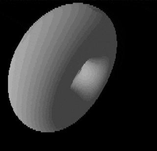

# donut

Rendering a donut in the terminal using Go and some math.

Idea, math and code stolen from [this excellent article](https://www.a1k0n.net/2011/07/20/donut-math.html)

^ this was recorded with a terminal size of `120x240`. On a saner terminal, this will look much more pixelated.

## Why?

 - fun

## Improvements

Some improvements from the original in the article:
 - Unicode rendering - uses the [Unicode full block (U+2588)](https://www.compart.com/en/unicode/U+2588) instead of ASCII characters for better looking renders
 - Colors: [256-bit terminal colors](https://www.lihaoyi.com/post/BuildyourownCommandLinewithANSIescapecodes.html#256-colors) are used for better looking grayscale as well as colored donuts!
 - Documented and configurable

## Usage

 - Clone this repo and `cd` into it
 - `go run .`
 - Change some of the configuration (in `donut.go`) and play with it
 - Look at it go!

## TODO

 - expose configurable parameters as command-line flags
 - other shapes?
